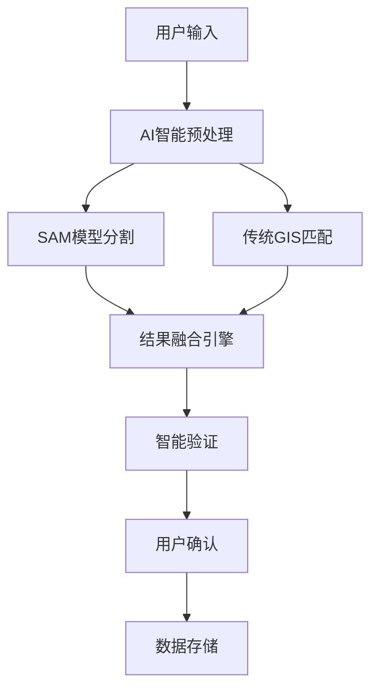

# 🚀 Next-Gen AI智能地图标注平台 - 技术方案

## 🎯 项目愿景

**FloorMap AI** - 结合Segment Anything Model (SAM)、现代Web技术和优秀UX设计的下一代数字地图标注平台。

## 🏗️ 技术架构

### **1. 混合智能架构 (Hybrid Intelligence)**



### **2. 核心技术栈**

```javascript
// 前端架构
const TechStack = {
  // 现代前端框架
  framework: "React 18 + TypeScript",
  state: "Zustand + React Query",
  
  // 地图渲染引擎
  mapEngine: "Leaflet.js + Pixi.js (WebGL)",
  canvas: "Fabric.js + Konva.js",
  
  // AI集成
  aiServices: "WebAssembly SAM + TensorFlow.js",
  
  // UI/UX
  ui: "Tailwind CSS + Framer Motion",
  components: "Radix UI + Headless UI",
  
  // 数据处理
  data: "IndexedDB + WebRTC",
  formats: "GeoJSON + Protocol Buffers"
};
```

## 🧠 核心创新功能

### **1. AI辅助智能识别**

```typescript
interface AIAssistant {
  // 智能预测
  predictStoreType(imageData: ImageData, coordinates: Point): StoreCategory;
  
  // 自动边界优化
  refineBoundaries(roughMask: Mask, context: MapContext): PreciseMask;
  
  // 语义理解
  extractSemanticInfo(visual: ImageData, text: OCRResult): StoreInfo;
  
  // 学习适应
  learnFromUserFeedback(corrections: UserCorrection[]): ModelUpdate;
}
```

### **2. 渐进式Web应用 (PWA)**

```javascript
// 服务工作线程
class AdvancedServiceWorker {
  // 智能缓存策略
  async cacheStrategy(request) {
    if (request.url.includes('/api/sam/predict')) {
      return this.networkFirst(request);
    }
    if (request.url.includes('/maps/')) {
      return this.cacheFirst(request);
    }
    return this.staleWhileRevalidate(request);
  }
  
  // 离线SAM推理
  async offlineSAMInference(imageData) {
    const wasmModule = await this.loadWasmSAM();
    return wasmModule.predict(imageData);
  }
}
```

### **3. 实时协作标注**

```typescript
// 实时协作系统
class CollaborativeAnnotation {
  // WebRTC数据通道
  private dataChannel: RTCDataChannel;
  
  // 操作同步
  syncOperation(operation: AnnotationOperation) {
    const compressed = this.compress(operation);
    this.broadcastToAll(compressed);
  }
  
  // 冲突解决
  resolveConflict(operations: Operation[]): ResolvedOperation {
    return this.operationalTransform(operations);
  }
}
```

## 🎨 用户界面创新

### **1. 现代化Material Design 3.0**

```typescript
// 组件设计系统
const DesignSystem = {
  theme: {
    colors: {
      primary: "hsl(var(--primary))",
      secondary: "hsl(var(--secondary))",
      accent: "hsl(var(--accent))",
    },
    
    spacing: "geometric scale (4px base)",
    typography: "Inter variable font",
    shadows: "layered depth system",
    animations: "spring physics"
  },
  
  components: {
    MapCanvas: "三维深度渲染",
    ToolPanel: "浮动面板设计", 
    StoreCard: "卡片化信息展示",
    Timeline: "操作历史时间线"
  }
};
```

### **2. 手势和语音交互**

```javascript
// 多模态交互
class MultimodalInput {
  // 手势识别
  async recognizeGesture(touchEvents) {
    const pattern = this.analyzeTouchPattern(touchEvents);
    
    switch(pattern) {
      case 'pinch-zoom': return this.handleZoom(touchEvents);
      case 'two-finger-rotate': return this.handleRotation(touchEvents);
      case 'long-press': return this.showContextMenu(touchEvents);
    }
  }
  
  // 语音命令
  async processVoiceCommand(audioBuffer) {
    const command = await this.speechToText(audioBuffer);
    return this.executeCommand(command);
  }
}
```

## 🔧 技术实现方案

### **1. 高性能渲染引擎**

```typescript
// WebGL加速渲染
class HighPerformanceRenderer {
  private gl: WebGL2RenderingContext;
  private shaderProgram: WebGLProgram;
  
  // 批量渲染优化
  renderBatch(annotations: Annotation[]) {
    const vertexBuffer = this.createVertexBuffer(annotations);
    const instanceBuffer = this.createInstanceBuffer(annotations);
    
    // GPU实例化渲染
    this.gl.drawArraysInstanced(
      this.gl.TRIANGLES, 
      0, 
      vertexBuffer.length, 
      annotations.length
    );
  }
  
  // 空间索引优化
  spatialIndex = new RBush<Annotation>();
  
  // 视野裁剪
  frustumCulling(viewport: Viewport): Annotation[] {
    return this.spatialIndex.search(viewport.bounds);
  }
}
```

### **2. AI模型优化**

```python
# 模型压缩和优化
class OptimizedSAM:
    def __init__(self):
        # 量化模型
        self.model = self.load_quantized_model()
        # 模型蒸馏
        self.lightweight_model = self.distill_model()
        
    async def predict_streaming(self, image_stream):
        """流式预测，降低延迟"""
        async for chunk in image_stream:
            yield await self.incremental_prediction(chunk)
    
    def adaptive_quality(self, device_info):
        """根据设备性能自适应模型"""
        if device_info.gpu_memory < 2048:
            return self.lightweight_model
        return self.model
```

### **3. 数据管理系统**

```typescript
// 分布式数据同步
class DistributedDataManager {
  // CRDT冲突解决
  private crdt = new YMap<AnnotationData>();
  
  // 增量同步
  async syncIncremental() {
    const changes = await this.getChanges();
    const compressed = this.compressChanges(changes);
    
    return this.p2pNetwork.broadcast(compressed);
  }
  
  // 本地优先存储
  async save(annotation: Annotation) {
    // 立即本地存储
    await this.localDB.put(annotation);
    
    // 异步云端同步
    this.backgroundSync.queue(annotation);
  }
}
```

## 🎯 创新特性

### **1. AI驱动的智能建议**

```typescript
interface AIInsights {
  // 智能店铺分类
  suggestCategory(visualFeatures: ImageFeatures): CategoryPrediction[];
  
  // 最佳标注点推荐
  recommendAnnotationPoints(image: ImageData): OptimalPoint[];
  
  // 质量评估
  assessAnnotationQuality(annotation: Annotation): QualityScore;
  
  // 完整性检查
  validateCompleteness(floorPlan: FloorPlan): ValidationResult;
}
```

### **2. 增强现实预览**

```javascript
// WebXR集成
class ARPreview {
  async initializeAR() {
    const session = await navigator.xr.requestSession('immersive-ar');
    
    // 空间映射
    const spatialMapping = new ARSpatialMapping();
    
    // 虚拟标注叠加
    return new ARAnnotationOverlay(spatialMapping);
  }
  
  // 实时预览
  renderARPreview(annotations, cameraFeed) {
    const virtualObjects = this.createVirtualAnnotations(annotations);
    return this.compositeReality(cameraFeed, virtualObjects);
  }
}
```

### **3. 智能数据分析**

```typescript
// 数据洞察引擎
class DataInsights {
  // 使用模式分析
  analyzeUsagePatterns(userData: UserInteraction[]): UsageInsights {
    return {
      hotspots: this.findPopularAreas(userData),
      workflows: this.identifyCommonWorkflows(userData),
      efficiency: this.calculateEfficiencyMetrics(userData)
    };
  }
  
  // 预测性维护
  predictMaintenanceNeeds(annotations: Annotation[]): MaintenancePlan {
    const outdatedData = this.detectOutdatedAnnotations(annotations);
    const conflictingData = this.findDataConflicts(annotations);
    
    return this.generateMaintenancePlan(outdatedData, conflictingData);
  }
}
```

## 🚀 部署架构

### **1. 微服务架构**

```yaml
# Docker Compose配置
services:
  # AI推理服务
  sam-inference:
    image: pytorch/pytorch:latest
    deploy:
      resources:
        reservations:
          devices:
            - driver: nvidia
              count: 1
              capabilities: [gpu]
  
  # API网关
  api-gateway:
    image: kong:latest
    environment:
      - KONG_PLUGINS=rate-limiting,cors,jwt
  
  # 实时通信
  websocket-server:
    image: node:18-alpine
    environment:
      - REDIS_URL=redis://redis:6379
  
  # 数据存储
  vector-db:
    image: weaviate/weaviate:latest
    environment:
      - ENABLE_MODULES=text2vec-openai
```

### **2. CDN和边缘计算**

```javascript
// 边缘计算优化
class EdgeOptimization {
  // 就近推理
  async inferAtEdge(imageData, userLocation) {
    const nearestNode = await this.findNearestEdgeNode(userLocation);
    return nearestNode.runInference(imageData);
  }
  
  // 智能缓存
  cacheStrategy = {
    models: "persistent", // 模型持久缓存
    images: "lru",       // 图像LRU缓存
    results: "ttl"       // 结果时间缓存
  };
}
```

## 📊 性能指标

### **目标性能**
- **首屏加载**: < 1.5秒
- **SAM推理延迟**: < 500ms
- **操作响应时间**: < 100ms
- **离线功能覆盖**: 80%
- **多用户并发**: 1000+用户

### **优化策略**
- **代码分割**: 按需加载组件
- **预加载**: 智能预测用户行为
- **压缩**: Brotli + WebP + AVIF
- **缓存**: 多层缓存策略
- **CDN**: 全球边缘分发

## 🎯 商业化路径

### **1. SaaS平台模式**
```javascript
const PricingTiers = {
  starter: {
    price: "$29/month",
    features: ["基础AI标注", "100MB存储", "基础支持"]
  },
  
  professional: {
    price: "$99/month", 
    features: ["高级AI功能", "10GB存储", "实时协作", "API访问"]
  },
  
  enterprise: {
    price: "Contact Sales",
    features: ["私有部署", "定制开发", "24/7支持", "无限存储"]
  }
};
```

### **2. API服务模式**
```javascript
const APIServices = {
  samInference: "$0.01/request",
  batchProcessing: "$0.005/request", 
  realtimeSync: "$0.001/message",
  dataStorage: "$0.1/GB/month"
};
```

## 🎉 总结

这个下一代方案融合了：

✅ **AI智能**: SAM模型 + 传统GIS的混合智能  
✅ **现代Web**: React + TypeScript + WebGL的高性能架构  
✅ **优秀UX**: Material Design 3.0 + 手势交互  
✅ **实时协作**: WebRTC + CRDT的无冲突协作  
✅ **边缘计算**: CDN + 边缘推理的全球分发  
✅ **商业价值**: SaaS + API的多元化收入模式

这将是一个真正领先的数字地图标注平台，既保持了AI的创新优势，又借鉴了成熟产品的最佳实践！